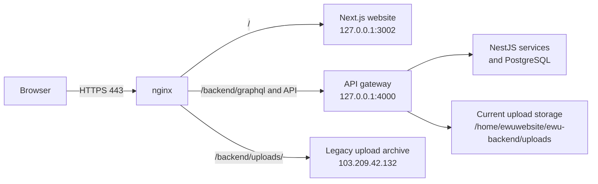

# Deployment and updates

This guide deploys the public site at `cloud.ewubd.edu` using nginx, Docker,
and the legacy upload archive. It is written for a fresh Linux server.

## Architecture



Requests for pages go to Next.js. API requests are proxied to the gateway.
Existing database records still point to older uploaded media, so nginx sends
media requests to the legacy archive until the whole archive is copied to the
current server. This also preserves video `Range` requests.

## Requirements

- Docker Engine and Docker Compose plugin
- nginx with TLS certificates for `cloud.ewubd.edu`
- Persistent upload storage at `/home/ewuwebsite/ewu-backend/uploads`
- PostgreSQL data volumes managed by Docker Compose

## Server preparation

```bash
sudo apt-get update
sudo apt-get install -y docker.io docker-compose-plugin nginx git
sudo systemctl enable --now docker nginx
sudo mkdir -p /home/ewuwebsite/ewu-backend/uploads
```

Configure DNS A records for `cloud.ewubd.edu` to the public server IP, then
install a valid TLS certificate and key. The nginx configuration below assumes
they are at `/etc/nginx/ssl/ewubd.edu.crt` and
`/etc/nginx/ssl/ewubd.edu.key`.

## First deployment

```bash
git clone https://github.com/abhijet02/ewuwebsite.git
cd ewuwebsite
cp ewu-backend/.env.example ewu-backend/.env
cp ewu-website/.env.example ewu-website/.env
```

Set real database, JWT, email, OAuth, and degree-verification values in the two
private `.env` files. Never place them in GitHub.

Before starting services, ensure the backend upload mount referenced by
`ewu-backend/docker-compose.yml` exists. It must be writable by the backend
container.

Start the API services:

```bash
docker compose -f ewu-backend/docker-compose.yml up -d --build
```

Build and run the public site:

```bash
docker build --tag ewu-website:production ewu-website
docker rm --force ewu-website 2>/dev/null || true
docker run --detach --name ewu-website --restart unless-stopped \
  --publish 127.0.0.1:3002:3002 ewu-website:production
```

## nginx

Create `/etc/nginx/conf.d/ewuwebsite.conf`. The public site must send the
frontend to port 3002 and GraphQL/API traffic to the gateway on port 4000.
Media requests must preserve byte-range support for MP4 playback.

```nginx
server {
    listen 80;
    listen [::]:80;
    server_name cloud.ewubd.edu localcloud.ewubd.edu;
    return 301 https://cloud.ewubd.edu$request_uri;
}

server {
    listen 443 ssl;
    listen [::]:443 ssl;
    server_name cloud.ewubd.edu localcloud.ewubd.edu;

    ssl_certificate /etc/nginx/ssl/ewubd.edu.crt;
    ssl_certificate_key /etc/nginx/ssl/ewubd.edu.key;
    ssl_protocols TLSv1.2 TLSv1.3;

    # Temporary compatibility route for the old 16 GB upload archive.
    # Keep proxy buffering off so browsers can seek in MP4 files.
location /backend/uploads/ {
    proxy_pass https://103.209.42.132;
    proxy_ssl_server_name on;
    proxy_ssl_name localcloud.ewubd.edu;
    proxy_set_header Host localcloud.ewubd.edu;
    proxy_set_header X-Real-IP $remote_addr;
    proxy_set_header X-Forwarded-For $proxy_add_x_forwarded_for;
    proxy_set_header X-Forwarded-Proto https;
    proxy_buffering off;
}

location /backend/ {
    proxy_pass http://127.0.0.1:4000/;
    proxy_http_version 1.1;
    proxy_set_header Host $host;
    proxy_set_header X-Real-IP $remote_addr;
    proxy_set_header X-Forwarded-For $proxy_add_x_forwarded_for;
    proxy_set_header X-Forwarded-Proto $scheme;
}

location / {
    proxy_pass http://127.0.0.1:3002;
    proxy_http_version 1.1;
    proxy_set_header Host $host;
    proxy_set_header X-Real-IP $remote_addr;
    proxy_set_header X-Forwarded-For $proxy_add_x_forwarded_for;
    proxy_set_header X-Forwarded-Proto $scheme;
    proxy_set_header Upgrade $http_upgrade;
    proxy_set_header Connection "upgrade";
}
}
```

Test and reload after editing:

```bash
nginx -t && systemctl reload nginx
```

## Verification

Run these checks after every deployment:

```bash
docker ps
curl -I https://cloud.ewubd.edu/pages/landing-page
curl -i -X OPTIONS https://cloud.ewubd.edu/backend/graphql \
  -H 'Origin: https://cloud.ewubd.edu' \
  -H 'Access-Control-Request-Method: POST'
curl -I 'https://cloud.ewubd.edu/backend/uploads/office-member/photos/EXISTING_FILE.webp'
```

Expected results are `200` for the page and image, and `204` or `200` for the
GraphQL preflight. For a video, request a range and expect `206 Partial
Content`:

```bash
curl -I -H 'Range: bytes=0-1023' \
  'https://cloud.ewubd.edu/backend/uploads/slider/files/EXISTING_FILE.mp4'
```

## Updating from GitHub

```bash
git pull --ff-only origin main
docker compose -f ewu-backend/docker-compose.yml up -d --build
docker build --tag ewu-website:production ewu-website
docker rm --force ewu-website
docker run --detach --name ewu-website --restart unless-stopped \
  --publish 127.0.0.1:3002:3002 ewu-website:production
```

Do not run commands that remove Docker volumes or the upload directory during
an update; those contain production data.

## Routine backup and recovery

Back up three independent things: the Git repository (source), PostgreSQL
volumes/databases (CMS data), and the upload directory (media). A Git clone
alone cannot restore uploaded photos or videos.

If images fail while pages load, test the image URL directly. A `404` normally
means the file is absent from both the current and legacy archives. A `502`
means nginx cannot reach the selected upstream. Check `docker ps`,
`systemctl status nginx`, and nginx's error log before restarting services.
