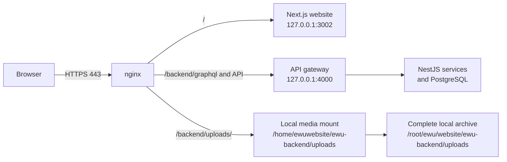

# Deployment and updates

This guide deploys the public site at `cloud.ewubd.edu` using nginx, Docker,
and the complete local upload archive. It is written for a fresh Linux server.

## Architecture



Requests for pages go to Next.js. API requests are proxied to the gateway.
nginx serves every media request from the local archive mount. Historical
`localcloud.ewubd.edu` URLs are redirected to the canonical
`cloud.ewubd.edu` origin. Static file serving preserves video `Range` requests.

## Requirements

- Docker Engine and Docker Compose plugin
- nginx with TLS certificates for `cloud.ewubd.edu`
- Complete upload archive at `/root/ewu/website/ewu-backend/uploads`
- Persistent bind mount at `/home/ewuwebsite/ewu-backend/uploads`
- PostgreSQL data volumes managed by Docker Compose

## Server preparation

```bash
sudo apt-get update
sudo apt-get install -y docker.io docker-compose-plugin nginx git
sudo systemctl enable --now docker nginx
sudo mkdir -p /home/ewuwebsite/ewu-backend/uploads
```

Configure DNS A records for `cloud.ewubd.edu` to the public server IP, then
install a valid TLS certificate and key. The nginx configuration below assumes
they are at `/etc/nginx/ssl/ewubd.edu.crt` and
`/etc/nginx/ssl/ewubd.edu.key`.

## First deployment

```bash
git clone https://github.com/abhijet02/ewuwebsite.git
cd ewuwebsite
cp ewu-backend/.env.example ewu-backend/.env
cp ewu-website/.env.example ewu-website/.env
```

Set real database, JWT, email, OAuth, and degree-verification values in the two
private `.env` files. Never place them in GitHub.

Before starting services, install and enable the supplied local archive mount.
It makes the complete archive available at the backend upload path referenced
by `ewu-backend/docker-compose.yml`:

```bash
sudo install -D -m 0644 deploy/systemd/home-ewuwebsite-ewu\\x2dbackend-uploads.mount \
  /etc/systemd/system/home-ewuwebsite-ewu\\x2dbackend-uploads.mount
sudo systemctl daemon-reload
sudo systemctl enable --now 'home-ewuwebsite-ewu\x2dbackend-uploads.mount'
```

Start the API services:

```bash
docker compose -f ewu-backend/docker-compose.yml up -d --build
```

Build and run the public site:

```bash
docker build --tag ewu-website:production ewu-website
docker rm --force ewu-website 2>/dev/null || true
docker run --detach --name ewu-website --restart unless-stopped \
  --publish 127.0.0.1:3002:3002 ewu-website:production
```

## nginx

Install `deploy/nginx/cloud.ewubd.edu.conf` as
`/etc/nginx/conf.d/localcloud.ewubd.edu.conf`. The public site sends the frontend to
port 3002 and GraphQL/API traffic to the gateway on port 4000. Media is served
locally and retains byte-range support for MP4 playback.

```nginx
# See deploy/nginx/cloud.ewubd.edu.conf for the complete configuration.
# It contains distinct cloud and localcloud HTTPS server blocks; the latter
# permanently redirects to cloud, while the former serves media locally.
```

Test and reload after editing:

```bash
sudo install -D -m 0644 deploy/nginx/cloud.ewubd.edu.conf \
  /etc/nginx/conf.d/localcloud.ewubd.edu.conf
sudo nginx -t && sudo systemctl reload nginx
```

## Verification

Run these checks after every deployment:

```bash
docker ps
curl -I https://cloud.ewubd.edu/pages/landing-page
curl -i -X OPTIONS https://cloud.ewubd.edu/backend/graphql \
  -H 'Origin: https://cloud.ewubd.edu' \
  -H 'Access-Control-Request-Method: POST'
curl -I 'https://cloud.ewubd.edu/backend/uploads/office-member/photos/EXISTING_FILE.webp'
```

Expected results are `200` for the page and image, and `204` or `200` for the
GraphQL preflight. For a video, request a range and expect `206 Partial
Content`:

```bash
curl -I -H 'Range: bytes=0-1023' \
  'https://cloud.ewubd.edu/backend/uploads/slider/files/EXISTING_FILE.mp4'
```

## Updating from GitHub

```bash
git pull --ff-only origin main
docker compose -f ewu-backend/docker-compose.yml up -d --build
docker build --tag ewu-website:production ewu-website
docker rm --force ewu-website
docker run --detach --name ewu-website --restart unless-stopped \
  --publish 127.0.0.1:3002:3002 ewu-website:production
```

Do not run commands that remove Docker volumes or the upload directory during
an update; those contain production data.

## Routine backup and recovery

Back up three independent things: the Git repository (source), PostgreSQL
volumes/databases (CMS data), and the upload directory (media). A Git clone
alone cannot restore uploaded photos or videos.

If images fail while pages load, test the image URL directly. A `404` normally
means the file is absent from the local archive. Check the bind mount with
`findmnt /home/ewuwebsite/ewu-backend/uploads`, then check `systemctl status
nginx` and nginx's error log before restarting services.
